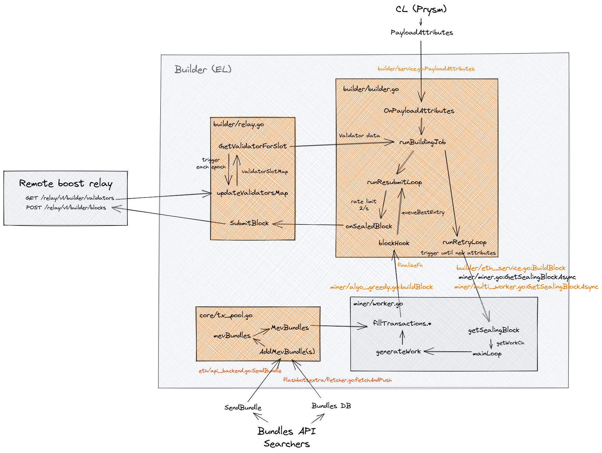

[geth readme](README.original.md)

# Builder API

Builder API implementing [builder spec](https://github.com/ethereum/builder-specs), making geth into a standalone block builder. 

Run on your favorite network, including Kiln and local devnet.

Requires forkchoice update to be sent for block building, on public testnets run beacon node modified to send forkchoice update on every slot [example modified beacon client (lighthouse)](https://github.com/flashbots/lighthouse)

Test with [mev-boost](https://github.com/flashbots/mev-boost) and [mev-boost test cli](https://github.com/flashbots/mev-boost/tree/main/cmd/test-cli).

Provides summary page at the listening address' root (http://localhost:28545 by default).

## How it works

* Builder polls relay for the proposer registrations for the next epoch

Builder has two hooks into geth:
* On forkchoice update, changing the payload attributes feeRecipient to the one registered for next slot's validator
* On new sealed block, consuming the block as the next slot's proposed payload and submits it to the relay

Local relay is enabled by default and overwrites remote relay data. This is only meant for the testnets!

## Limitations

* Blocks are only built on forkchoice update call from beacon node
* Does not accept external blocks
* Does not have payload cache, only the latest block is available

# Usage

Configure geth for your network, it will become the block builder.

Builder-related options:
```
$ geth --help
BUILDER API OPTIONS:
    --builder                      (default: false)
          Enable the builder
    --builder.beacon_endpoint value (default: "http://127.0.0.1:5052")
    --builder.bellatrix_fork_version value (default: "0x02000000")
    --builder.dry-run              (default: false)
    --builder.genesis_fork_version value (default: "0x00000000")
    --builder.genesis_validators_root value (default: "0x0000000000000000000000000000000000000000000000000000000000000000")
    --builder.listen_addr value    (default: ":28545")
          Listening address for builder endpoint [$BUILDER_LISTEN_ADDR]
    --builder.local_relay          (default: false)
    --builder.no_bundle_fetcher    (default: false)
    --builder.relay_secret_key value (default: "0x2fc12ae741f29701f8e30f5de6350766c020cb80768a0ff01e6838ffd2431e11")
    --builder.remote_relay_endpoint value
    --builder.secret_key value     (default: "0x2fc12ae741f29701f8e30f5de6350766c020cb80768a0ff01e6838ffd2431e11")
    --builder.validator_checks     (default: false)
    --builder.validation_blacklist value
    --miner.algotype value         (default: "mev-geth")
    --miner.blocklist value
    --miner.extradata value
```

Environment variables:
```
BUILDER_TX_SIGNING_KEY - private key of the builder used to sign payment transaction
```

## Details of the implementation

There are two parts of the builder.

1. `./builder` responsible for communicating with the relay
2. `./miner` responsible for producing blocks

### `builder` module

Main logic of the builder is in the `builder.go` file.

Builder is driven by the modified consensus client that calls `OnPayloadAttribute` indicating that block should be produced.
After requesting additional validator data from the relay builder starts building job with `runBuildingJob`.
Building job continuously makes a request to the `miner` with the correct parameters and submits produced block.

* Builder retries build block requests every second on average.
* If the job is running but a new one is submitted for a different slot we cancel previous job.
* All jobs have 12s deadline.
* If new request is submitted for the same slot as before but with different parameters, we run these jobs in parallel.
  It is possible to receive multiple requests from CL for the same slot but for different parent blocks if there is a possibility
  of a missed block.
* All submissions to the relay are rate limited at 2 req/s
* Only blocks that have more profit than the previous best submissions for the particular job are submitted.

Additional features of the builder:
* Builder can submit data about build blocks to the database. It stores block data, included bundles, and all considered bundles.
  Implemented in `flashbotsextra.IDatabaseService`.
* It's possible to run local relay in the same process
* It can validate blocks instead of submitting them to the relay. (see `--builder.dry-run`)

### `miner` module

Miner is responsible for block creation. Request from the `builder` is routed to the `worker.go` where
`generateWork` does the job of creating a block.

* Coinbase of the block is set to the address of the block proposer, fee recipient of the validator receives its eth
  in the last tx in the block.
* We reserve gas for the proposer payment using `proposerTxPrepare` and commit proposer payment after txs are added with
  `proposerTxCommit`. We do it in a way so all fees received by the block builder are sent to the fee recipient.
* Transaction insertion is done in `fillTransactionsAlgoWorker` \ `fillTransactions`. Depending on the algorithm selected.
  Algo worker (greedy) inserts bundles whenever they belong in the block by effective gas price but default method inserts bundles on top of the block.
  (see `--miner.algo`)
* Worker is also responsible for simulating bundles. Bundles are simulated in parallel and results are cached for the particular parent block.
* `algo_greedy.go` implements logic of the block building. Bundles and transactions are sorted in the order of effective gas price then
  we try to insert everything into to block until gas limit is reached. Failing bundles are reverted during the insertion but txs are not.
* Builder can filter transactions touching a particular set of addresses.
  If a bundle or transaction touches one of the addresses it is skipped. (see `--miner.blocklist` flag)

## Bundle Movement 

There are two ways bundles are moved to builders 

1. via API -`sendBundle` 
2. via Data Base - `flashbotsextra.IDatabaseService`

### `fetcher` service 
* Fetcher service is part of `flashbotsextra.IDatabaseService` which is responsible for fetching the bundles from db and pushing into mev bundles queue which will be processed by builder. 
* Fetcher is a background process which fetches high priority and low priority bundles from db. 
* Fetcher fetches `500` high priority bundles on every head change, and `100` low priority bundles in the interval of every `2 seconds`.  

## Block builder diagram


